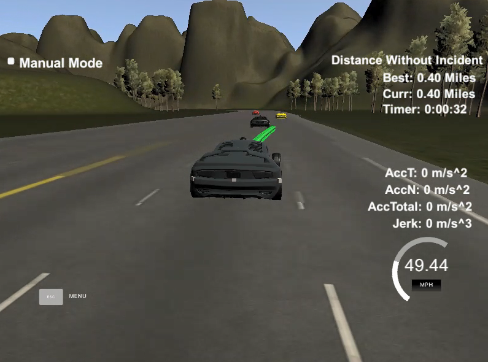

# CarND-Path-Planning-Project
This is the first project of the Term 3 in Self-Driving Car Engineer Nanodegree Program
 
***

***

## Goals
In this project your goal is to safely navigate around a virtual highway with other traffic that is driving in the following preconditions:

* +-10 MPH of the 50 MPH speed limit. 
* Total acceleration should be less than 10 m/s^2
* Jerk should be less than 10 m/s^3.
* The car should try to go as close as possible to the 50 MPH speed limit, which means passing slower traffic when possible, note that other cars will try to change lanes too.
* The car should avoid hitting other cars. 
* The car should be able to make one complete loop around the 6946m highway. 

We can get following information as the input of path planning algorithm

* Car's localization (see the section "Main car's localization Data ...")
* sensor fusion data (see the section "Sensor Fusion Data ...")
* sparse map list of waypoints around the highway (see the section "Sparse Map Waypoints Data")
* Previous path data given to the Planner (see the section "Previous path data ...")

***

## Input data provided by simulator

#### Main car's localization Data (No Noise)
* ["x"] The car's x position in map coordinates
* ["y"] The car's y position in map coordinates
* ["s"] The car's s position in frenet coordinates
* ["d"] The car's d position in frenet coordinates
* ["yaw"] The car's yaw angle in the map
* ["speed"] The car's speed in MPH

#### Previous path data given to the Planner
//Note: Return the previous list but with processed points removed, can be a nice tool to show how far along the path has processed since last time. 

* ["previous_path_x"] The previous list of x points previously given to the simulator
* ["previous_path_y"] The previous list of y points previously given to the simulator

#### Sparse Map Waypoints Data
Each waypoint in the list contains  [x,y,s,dx,dy] values. x and y are the waypoint's map coordinate position, the s value is the distance along the road to get to that waypoint in meters, the dx and dy values define the unit normal vector pointing outward of the highway loop.

The highway's waypoints loop around so the frenet s value, distance along the road, goes from 0 to 6945.554.

#### Previous path's end s and d values 
* ["end_path_s"] The previous list's last point's frenet s value
* ["end_path_d"] The previous list's last point's frenet d value

#### Sensor Fusion Data, a list of all other car's attributes on the same side of the road. (No Noise)

["sensor_fusion"] A 2d vector of cars and then that car's [car's unique ID, car's x position in map coordinates, car's y position in map coordinates, car's x velocity in m/s, car's y velocity in m/s, car's s position in frenet coordinates, car's d position in frenet coordinates. 

***

## Details
1. The car uses a perfect controller and will visit every (x,y) point it recieves in the list every .02 seconds. The units for the (x,y) points are in meters and the spacing of the points determines the speed of the car. The vector going from a point to the next point in the list dictates the angle of the car. Acceleration both in the tangential and normal directions is measured along with the jerk, the rate of change of total Acceleration. The (x,y) point paths that the planner recieves should not have a total acceleration that goes over 10 m/s^2, also the jerk should not go over 50 m/s^3. (NOTE: As this is BETA, these requirements might change. Also currently jerk is over a .02 second interval, it would probably be better to average total acceleration over 1 second and measure jerk from that.

2. There will be some latency between the simulator running and the path planner returning a path, with optimized code usually its not very long maybe just 1-3 time steps. During this delay the simulator will continue using points that it was last given, because of this its a good idea to store the last points you have used so you can have a smooth transition. previous_path_x, and previous_path_y can be helpful for this transition since they show the last points given to the simulator controller with the processed points already removed. You would either return a path that extends this previous path or make sure to create a new path that has a smooth transition with this last path.

## Supportive Package Used
#### Spline Curve Generation
A really helpful resource for doing this project and creating smooth trajectories was using http://kluge.in-chemnitz.de/opensource/spline/, the spline function is in a single hearder file is really easy to use.

***

## Reflection
#### Lane Change Logic
1. Driving lane of the detected vehicles are identified using their $d$ coordinates.
2. After checking every vehicle, __s__ cooridnates are checked by comparing their $s$ coordintates and ego-vehicle's $s$ coordinates. `lane_behind, lane_ahead` is set to __true__ if there is a vehicle running within 30m ahead/behind of the ego vehicle.
3. If there is other vehicle in front of ego-vehicle `lane_ahead[ego_lane] == true`, vehicle should try to find if there is available lane which is safe to change. Otherwise, vehicle slow down to avoid collision. Please see the _L.299 to L.316_ for its implementation
4. Target lane is stored in the variable named `lane`, which is used to generate trajectory.

#### Calculate Trajectory
1. Firstly, check the last two points of the previous trajectory. If there is no previous trajectory available, car position is used as the starting reference. _L.330 to L.357_
2. Add evenly spaced 3 points ahead of the starting reference. _L.359 to L.369_
3. Convert global coordinates to car-relative coordinates _L.371 to L.380_
4. Calculate spline curve _L.382 to L.397_
5. Split spline curve evenly to generate target points _L.399 to L.428_
6. Send calculated trajectory to the simulator _L.430 to L.437_

***

## Basic Build Instructions
1. Clone this repo.
2. Make a build directory: `mkdir build && cd build`
3. Compile: `cmake .. && make`
4. Run it: `./path_planning`.